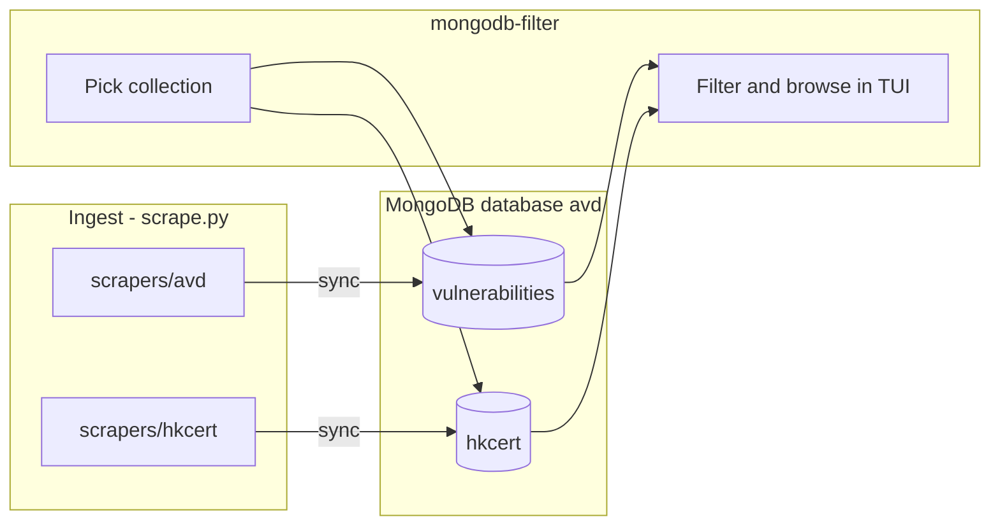

# HKCERT Security Bulletin Scraper

## Data architecture (scrapers → MongoDB → mongodb-filter)

Two programs share one MongoDB config (`[mongodb.toml](mongodb.toml)`): **one database** (`avd`), **one collection per scraper**.


| Scraper folder             | MongoDB collection | Ingest CLI                      |
| -------------------------- | ------------------ | ------------------------------- |
| `scrapers/avd/`            | `vulnerabilities`  | `python scrape.py tui` / `sync` |
| `scrapers/hkcert/`         | `hkcert`           | same                            |
| *(future)* `scrapers/foo/` | name in TOML       | same                            |





**Ingest:** shared `[runner.py](avd_scraper/runner.py)` + `[mongo.py](avd_scraper/mongo.py)` upsert into the scraper’s collection (`[mongodb.collections]` in TOML).

**mongodb-filter:** same `uri` + `database`; TUI picks `vulnerabilities` or `hkcert`, then filter/browse paged results in the terminal. **No JSON file export** — not planned and not documented (see section 5).

```bash
python scrape.py tui    # choose scraper → writes to its collection
mongodb-filter          # pick collection → filter/browse in terminal
```

**Not in scope:** `mongodb-filter --mongo-collection hkcert --output data/hkcert_export.json` or any `--output` / per-scraper JSON export paths.

## Context

HKCERT [Security Bulletin](https://www.hkcert.org/security-bulletin) is server-rendered HTML, paginated via `?item_per_page=10&page=N`. Every scraper lives under `avd_scraper/scrapers/{name}/`.

## Scraper folder layout

```
avd_scraper/scrapers/
  __init__.py       # registry
  avd/              # migrated from parsers/ + AVDProvider
  hkcert/           # new
```

Each folder: `config.py`, `provider.py`, `filter_fields.py`, `parsers/list.py`, `parsers/detail.py`.

## Document shape

Top-level (shared with AVD): `type`, `code`, `title`, `disclosure_date`, `status`, `source`, `cross_refs`.

`**details.hkcert**` must include every bulletin section the site shows (scraped from the detail page, not list-card teaser only):


| Field                                       | Source on page                                                                   | Notes                                                                                                                                |
| ------------------------------------------- | -------------------------------------------------------------------------------- | ------------------------------------------------------------------------------------------------------------------------------------ |
| `intro`                                     | `.page-intro` (main summary paragraph(s) before `h2` sections)                   | Full text, not truncated                                                                                                             |
| `note`                                      | `p` block whose content starts with **Note:** (exploitation / advisory callouts) | Plain text or HTML-stripped; omit if absent                                                                                          |
| `impact`                                    | `h2` → **Impact**                                                                | Body until next `h2` (may be tags/list of impact types)                                                                              |
| `systems_affected`                          | `h2` → **System / Technologies affected**                                        | Full paragraph text                                                                                                                  |
| `solutions`                                 | `h2` → **Solutions**                                                             | Full text; preserve vendor fix URLs as structured `solution_links` if present                                                        |
| `vulnerability_identifiers`                 | `h2` → **Vulnerability Identifier**                                              | List of `{ "cve_id": "CVE-2025-48595" }` objects (parse every `CVE-YYYY-NNNN` in section)                                            |
| `source`                                    | `h2` → **Source**                                                                | Vendor/product name (e.g. `Android`) — stored as `details.hkcert.bulletin_source` to avoid clashing with top-level `source` metadata |
| `related_links`                             | `h2` → **Related Link**                                                          | List of URL strings (one or more links)                                                                                              |
| `risk_level`                                | `.risk-meter__text` / `.sr-only`                                                 | e.g. `Medium Risk`                                                                                                                   |
| `release_date`, `last_update_date`, `views` | detail metadata row                                                              | Same strings as on site                                                                                                              |
| `summary`                                   | optional                                                                         | List-page teaser only if useful for list-only runs                                                                                   |


`**cross_refs`** (top-level): one entry per CVE from `vulnerability_identifiers`:

```json
{ "type": "CVE", "code": "2025-48595" }
```

Extend `[ListEntry.to_record](avd_scraper/models.py)` to build `cross_refs` from `details.hkcert.vulnerability_identifiers[].cve_id` (and legacy `cve_ids` list if used internally).

**Parser rule:** `[scrapers/hkcert/parsers/detail.py](avd_scraper/scrapers/hkcert/parsers/detail.py)` walks `h2` headings by exact title match (case-sensitive labels as on site) and collects sibling nodes until the next `h2`; `intro` / `note` parsed before the first `h2` (`page-intro` + Note paragraph).

## 1. Migrate AVD → `scrapers/avd/`

Move parsers, provider, URL config, and AVD `filter_fields.py` from `[parsers/](avd_scraper/parsers/)` and `[providers.py](avd_scraper/providers.py)`. Re-export from `[providers.py](avd_scraper/providers.py)` for stable imports.

## 2. Add `scrapers/hkcert/`

- `**config.py`:** URLs; `DEFAULT_COLLECTION = "hkcert"`; `browser_fallback=False` for scrape settings
- `**provider.py`:** `key = "hkcert"`; list/detail URLs; `default_mongo_collection = "hkcert"`
- `**parsers/list.py`:** slug, title, risk, status badge, dates, views, teaser (for `list_only`)
- `**parsers/detail.py`:** required fields — `intro`, `note`, `impact`, `systems_affected`, `solutions`, `vulnerability_identifiers` (with `cve_id` each), `bulletin_source`, `related_links`, plus metadata (`risk_level`, dates, views). Tests assert all sections present on fixture HTML.
- `**filter_fields.py`:** e.g. `details.hkcert.risk_level`, `details.hkcert.bulletin_source`, `details.hkcert.impact`, text on `intro` / `solutions` / `cross_refs.code`

## 3. Registry

`[avd_scraper/scrapers/__init__.py](avd_scraper/scrapers/__init__.py)`: `PROVIDERS = {"avd": ..., "hkcert": ...}`; `get_provider`, `all_providers`.

## 4. MongoDB config

`[mongodb.toml](mongodb.toml)`:

```toml
[mongodb]
uri = "mongodb://localhost:27017"
database = "avd"
collection = "vulnerabilities"
conflict = "prompt"

[mongodb.collections]
avd = "vulnerabilities"
hkcert = "hkcert"
```

`mongo_collection_for_provider()` in `[config.py](avd_scraper/config.py)`; apply in `[scrape_tui.py](avd_scraper/scrape_tui.py)` and `[sync.py](avd_scraper/sync.py)`.

**Note:** `hkcert` is the **collection** name inside database `avd`, not a separate database.

## 5. mongodb-filter

**Add:**

- Collection picker TUI from `[mongodb.collections]` (labels: `avd` / `vulnerabilities`, `hkcert` / `hkcert`)
- Per-scraper fields from `scrapers/{name}/filter_fields.py`
- Optional `--mongo-collection` to skip picker (connect to one collection only)


Keep `[mongo_filter.py](avd_scraper/mongo_filter.py)` query helpers (`build_mongo_query`, `fetch_filtered_page`, `distinct_values`) for the TUI. `export_filtered_results` can be deleted or left unused—prefer delete if nothing else calls it.

## 6. Tests and docs

- `tests/scrapers/hkcert/` + fixtures
- Update `[README.md](README.md)`: collection `hkcert`, scraper folders, mongodb-filter = filter/browse only

## 7. Out of scope

- JSON export from mongodb-filter (cancelled)
- `/tc/security-bulletin` locale
- Package rename

## Key files


| Area   | Files                                                                            |
| ------ | -------------------------------------------------------------------------------- |
| HKCERT | `avd_scraper/scrapers/hkcert/`**                                                 |
| Layout | `avd_scraper/scrapers/avd/**`, `scrapers/__init__.py`                            |
| Filter | `[tui.py](avd_scraper/tui.py)`, `[mongo_filter.py](avd_scraper/mongo_filter.py)` |
| Config | `[mongodb.toml](mongodb.toml)`                                                   |


